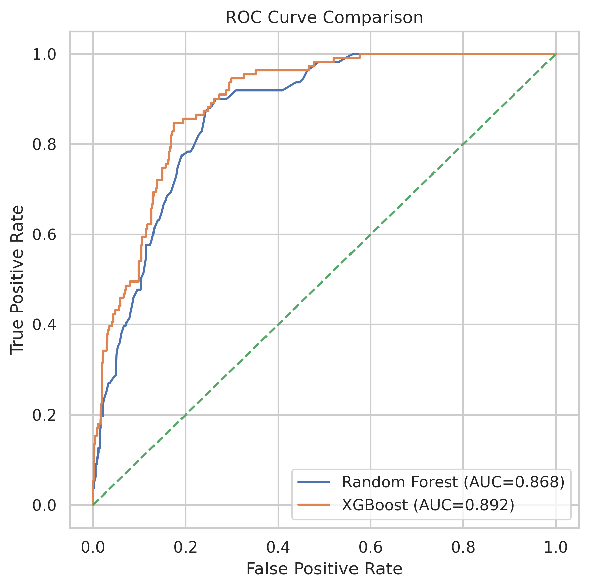
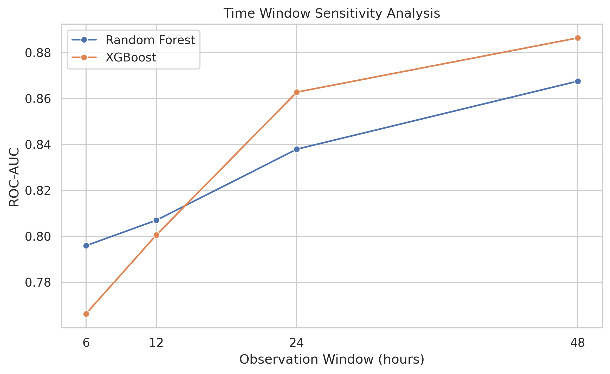
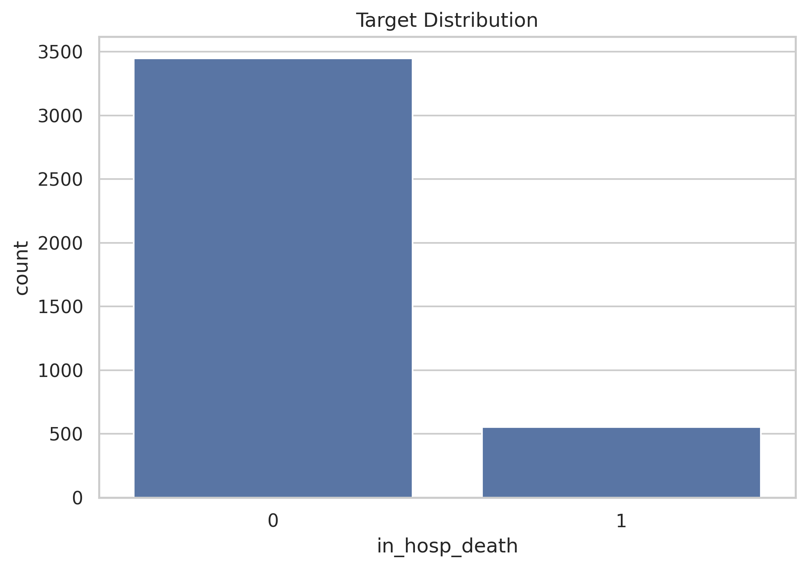
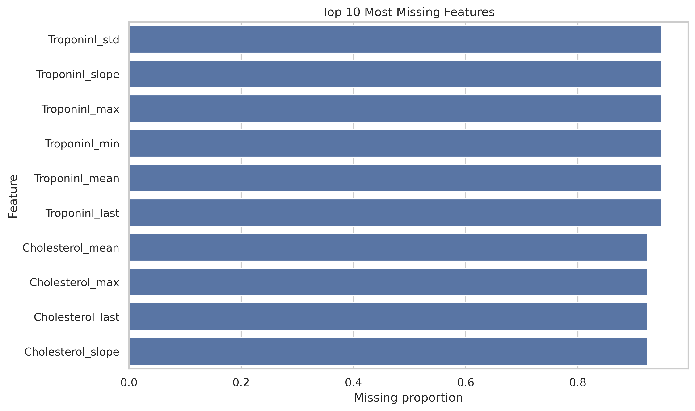
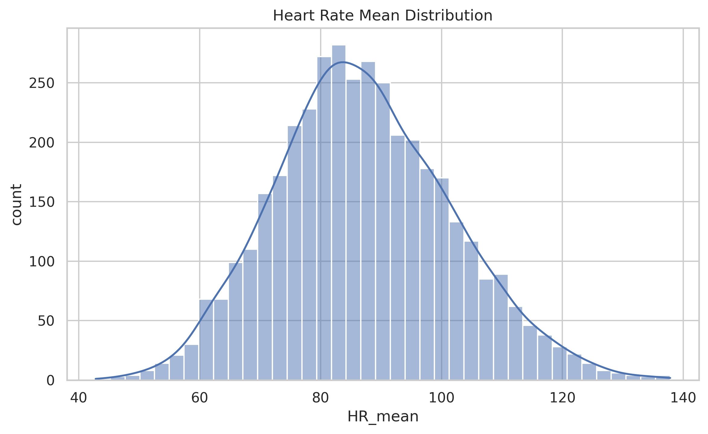
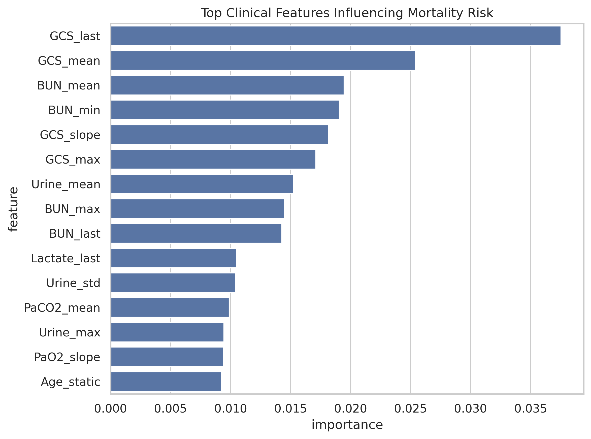
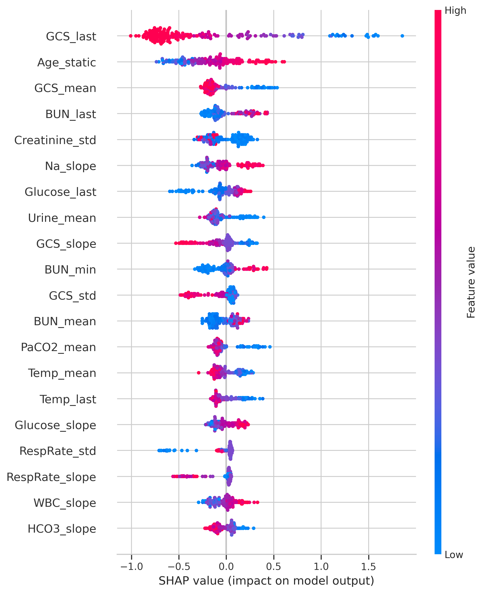
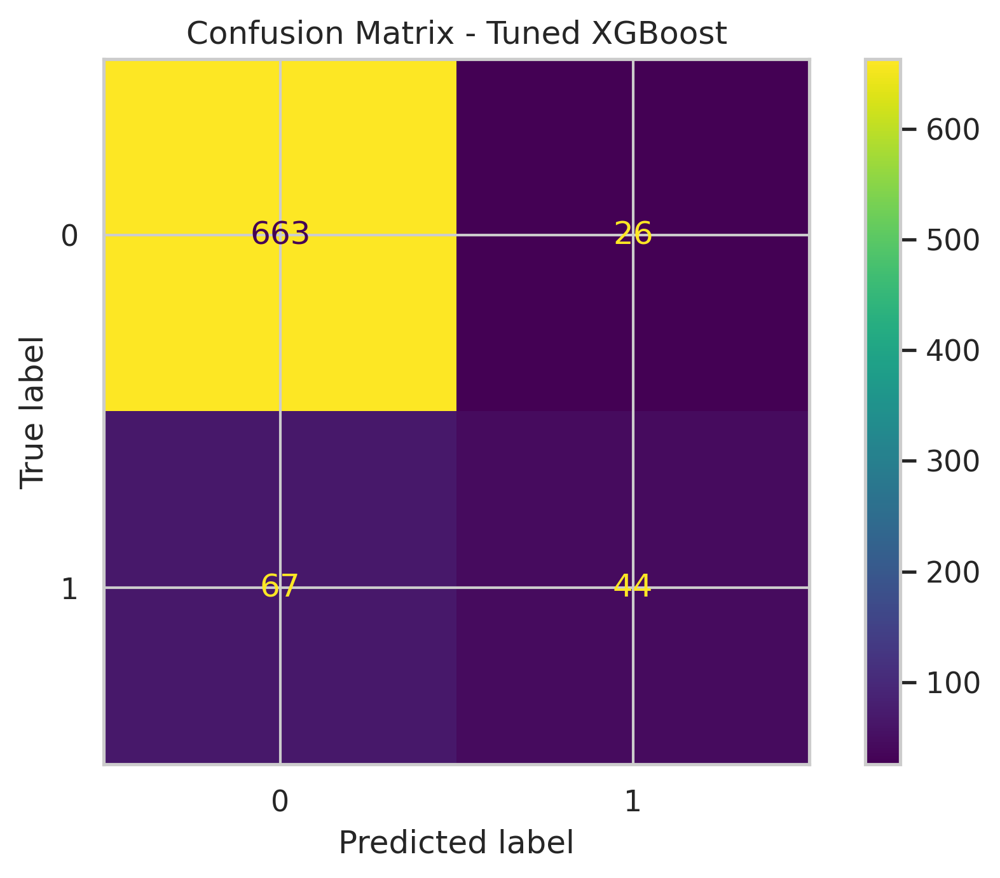

# Early Prediction of Clinical Deterioration Risk in ICU Patients

## Overview
This project focuses on the **early prediction of clinical deterioration risk** in ICU patients using physiological measurements collected during the initial hours of ICU admission.

The task is framed as a **prognostic modelling problem**, where the goal is to estimate the probability of **future in-hospital mortality** using early time-series clinical data. In-hospital mortality is treated here as a proxy for severe clinical deterioration risk.

---

## Repository Structure
- `notebooks/icu_deterioration_prediction.ipynb` — main end-to-end notebook  
- `outputs/` — generated plots and figures  
- `data/` — dataset instructions and download guidance  
- `requirements.txt` — Python dependencies  

---

## Dataset
The dataset used is from the **PhysioNet 2012 Challenge**:

- Source: https://physionet.org/content/challenge-2012/1.0.0/  
- 4,000 ICU patient stays (Set A)  
- Includes:
  - Static features such as Age, Gender, Height, Weight, and ICUType  
  - 37 time-series physiological and laboratory variables  
- Target:
  - In-hospital mortality (binary classification)  

The raw dataset is not included in this repository. Please refer to `data/README.md` for instructions on downloading and organising the dataset locally.

---

## Methodology

### Preprocessing
- Converted timestamps from `HH:MM` to continuous hours  
- Replaced coded missing values (`-1`) with `NaN`  
- Filtered observations using time windows: 6h, 12h, 24h, and 48h  

### Feature Engineering
Irregular ICU time-series data was transformed into summary features:
- Mean  
- Minimum  
- Maximum  
- Last observed value  
- Standard deviation  
- Linear trend (slope)  

### Models
- Random Forest  
- XGBoost  
- Multi-Layer Perceptron (MLP)  

---

## Results

### Model Performance

| Model | ROC-AUC |
|------|--------:|
| Random Forest | 0.868 |
| XGBoost | 0.883 |
| Tuned XGBoost | **0.892** |
| MLP | 0.661 |

Cross-validation (XGBoost):
- Mean AUC: **0.864**
- Std: **0.016**

---

### Time-Window Sensitivity

| Window (hours) | Random Forest | XGBoost |
|---------------|--------------:|--------:|
| 6  | 0.796 | 0.767 |
| 12 | 0.807 | 0.800 |
| 24 | 0.838 | 0.862 |
| 48 | 0.868 | 0.887 |

---

### Threshold Tuning (Clinical Perspective)

Default threshold (**0.5**) was adjusted to **0.3** to improve detection of high-risk patients.

**Confusion Matrix (threshold = 0.3):**
- TN = 663  
- FP = 26  
- FN = 67  
- TP = 44  

**Metrics:**
- Precision ≈ **0.63**  
- Recall ≈ **0.40**  

This improves sensitivity (recall) at the cost of more false positives — a clinically meaningful trade-off.

---

## Visualisations

### ROC Curve


### Time Window Sensitivity


### Target Distribution


### Missing Data Profile


### Heart Rate Distribution


### Feature Importance


### SHAP Interpretation


### Confusion Matrix (Threshold = 0.3)


---

## Key Insights
- Early ICU data already contains useful predictive signals  
- XGBoost consistently outperforms other models  
- Performance improves with longer observation windows  
- Neurological (GCS), renal (BUN), and metabolic features are strong predictors  
- Threshold tuning significantly improves detection of high-risk patients  

---

## Clinical Interpretation
The default model (threshold = 0.5) misses a significant number of high-risk patients.  
Lowering the threshold to **0.3** improves recall, making the model more suitable for clinical screening.

In healthcare, **missing a high-risk patient is often more critical than a false alarm**, so threshold selection must align with clinical priorities.

---

## Limitations
- High missingness (>90%) in some lab features  
- Time-series summarisation reduces temporal detail  
- No external validation dataset  
- Mortality used as proxy for deterioration  

---

## Future Work
- Missingness-aware modelling  
- Sequence models (LSTM / Transformers)  
- Precision-Recall optimisation  
- External validation  
- Cost-sensitive learning  

---

## How to Run

```bash
git clone https://github.com/Vgowtham009-lab/icu-prediction-project.git
cd icu-prediction-project
pip install -r requirements.txt
```

Download dataset from PhysioNet and follow instructions in `data/README.md`.

Run:
```bash
jupyter notebook notebooks/icu_deterioration_prediction.ipynb
```

---

## References

Goldberger, A.L. et al. (2000) *PhysioBank, PhysioToolkit, and PhysioNet*. Circulation.  

Silva, I. et al. (2012) *Predicting in-hospital mortality of ICU patients*. Computing in Cardiology.  

Chen, T. and Guestrin, C. (2016) *XGBoost: A Scalable Tree Boosting System*. KDD.  

---

## Author
**Gowtham Vaddanam**  
MSc Data Science  
University of Hertfordshire
